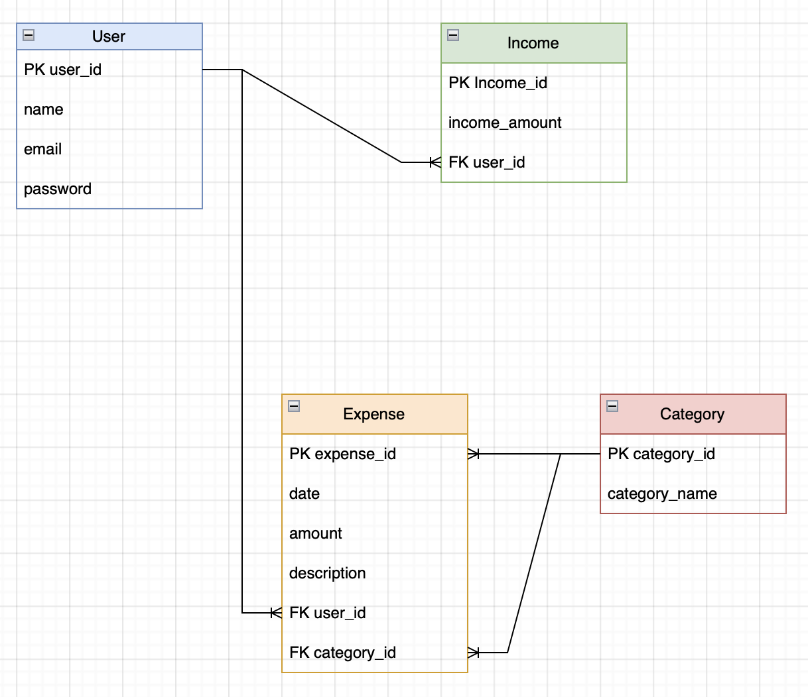
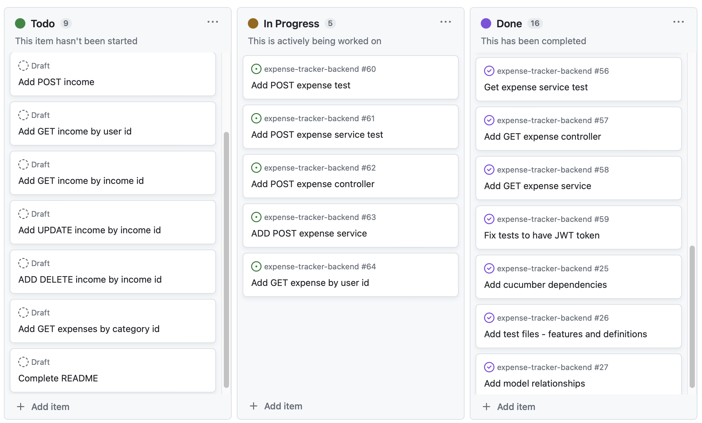

# Expense Tracker

## Table of Contents
- [Overview](#overview)
- [Approach](#approach)
- [Tools and Technologies](#tools-and-technologies)
- [User Stories](#user-stories)
- [ERD Diagram](#erd-diagram)
- [API Endpoints](#api-endpoints)
- [Planning Documentation](#planning-documentation)
- [Dependencies](#dependencies)
- [Resources](#resources)
- [Acknowledgements](#acknowledgements)

## Overview
This is a full-stack expense tracker application where users are able to add their income, as well as, add, update, view, and delete their expenses. It categorizes expenses by categories and allows users to better analyze their spending patterns.

## Approach
I first began by brainstorming the models needed (User, Expense, Income, and Category). Once models were decided on I created and ERD diagram showing the one-to-many and many-to-one relationships between the models and writing User Stories.

After creating models, in Spring Boot, I began implementing tests using Cucumber and Rest assured. Once all the scenerios were created, I implemented services, repositories and controllers to test each CRUD method one-by-one, ensuring that I was getting the expected results both in IntelliJ and in Postman.

## Tools and Technologies
- Java
- IntelliJ - IDE
- Spring Boot
- JPA
- JWT
- Maven
- Postman
- Cucumber Spring Integration

## User Stories
- As a user, I want to be able to create an account in order to use the expense tracker application.
- As a user, I want to be able to enter income amount in order to set a spending limit amount.
- As a user, I want to be able to create a new expense entry with details such as date, amount, description, and category.
- As a user, I want to be able to view a list of expenses, sorted by date or amount, in order to better track my spending.
- As a user, I want to be able to update an expense entry if needed.
- As a user, I want to be able to delete an expense entry that is no longer needed.
- As a user, I want to be able to view expenses by category so that I can better analyze my spending patterns.
- As a user, I want to be able to search for specific expenses based on keywords, date, or category.
- As a user, I want to be able to view a list of incomes. 
- As a user, I want to be able to update an income entry if needed.
- As a user, I want to be able to delete an income entry that is no longer needed.

## ERD Diagram


## API Endpoints

| Request Type | URL                                    | Functionality                | Access  |
| ------------ | -------------------------------------- | ---------------------------- | ------- |
| POST         | /api/auth/login/                       | User login                   | Public  |
| POST         | /api/auth/register/                    | User registration            | Public  |
| POST         | /api/expenses/                         | Creates expense entry        | Private |
| GET          | /api/expenses/user/{userId}/           | Gets expenses by user id     | Private |
| GET          | /api/expenses/{expenseId}/             | Gets expense by expense id   | Private |
| PUT          | /api/expense/{expenseId}/              | Updates expense entry        | Private |
| DELETE       | /api/expense/{expenseId}/              | Deletes expense entry        | Private |
| POST         | /api/incomes/                          | Creates income entry         | Private |
| GET          | /api/incomes/user/{userId}/            | Gets incomes by user id      | Private |
| GET          | /api/incomes/{incomeId}/               | Gets income by income id     | Private |
| PUT          | /api/income/{incomeId}/                | Updates income entry         | Private |
| DELETE       | /api/income/{incomeId}/                | Delete income entry          | Private |
| GET          | /api/categories/{categoryId}/expenses/ | Gets expenses by category id | Private |

## Planning Documentation


## Dependencies
```
<dependency>
	<groupId>org.springframework.boot</groupId>
	<artifactId>spring-boot-starter</artifactId>
</dependency>
<dependency>
	<groupId>org.springframework.boot</groupId>
	<artifactId>spring-boot-starter-test</artifactId>
	<scope>test</scope>
</dependency>
<dependency>
	<groupId>org.springframework.boot</groupId>
	<artifactId>spring-boot-starter-web</artifactId>
</dependency>
<dependency>
	<groupId>org.springframework.boot</groupId>
	<artifactId>spring-boot-starter-data-jpa</artifactId>
</dependency>
<dependency>
	<groupId>org.springframework.boot</groupId>
	<artifactId>spring-boot-devtools</artifactId>
	<scope>runtime</scope>
	<optional>true</optional>
</dependency>
<dependency>
	<groupId>com.h2database</groupId>
	<artifactId>h2</artifactId>
	<scope>runtime</scope>
</dependency>
<dependency>
	<groupId>org.springframework.boot</groupId>
	<artifactId>spring-boot-starter-jdbc</artifactId>
</dependency>
<dependency>
	<groupId>junit</groupId>
	<artifactId>junit</artifactId>
	<scope>test</scope>
</dependency>
<dependency>
	<groupId>io.cucumber</groupId>
	<artifactId>cucumber-java</artifactId>
	<version>${cucumber.version}</version>
    <scope>test</scope>
</dependency>
<dependency>
	<groupId>io.cucumber</groupId>
	<artifactId>cucumber-junit</artifactId>
	<version>${cucumber.version}</version>
	<scope>test</scope>
</dependency>
<dependency>
	<groupId>io.cucumber</groupId>
	<artifactId>cucumber-spring</artifactId>
	<version>${cucumber.version}</version>
	<scope>test</scope>
</dependency>
<dependency>
	<groupId>io.rest-assured</groupId>
	<artifactId>rest-assured</artifactId>
	<version>4.3.0</version>
	<scope>test</scope>
</dependency>
<dependency>
	<groupId>org.springframework.boot</groupId>
	<artifactId>spring-boot-starter-security</artifactId>
	<version>3.0.5</version>
</dependency>
<dependency>
	<groupId>io.jsonwebtoken</groupId>
	<artifactId>jjwt-api</artifactId>
	<version>0.11.5</version>
</dependency>
<dependency>
	<groupId>io.jsonwebtoken</groupId>
	<artifactId>jjwt-impl</artifactId>
	<version>0.11.5</version>
	<scope>runtime</scope>
</dependency>
<dependency>
	<groupId>io.jsonwebtoken</groupId>
	<artifactId>jjwt-jackson</artifactId>
	<version>0.11.5</version>
	<scope>runtime</scope>
</dependency>
```

## Resources
- Stack Overflow
- Code from previous API projects: Coffee API and Real-Estate API

## Acknowledgements
Big thanks to [Maksym Zinchenko](https://github.com/maklaut007) and [Obinna Umerah](https://github.com/ObinnaUmerah) for their help and support throughout this project. 

